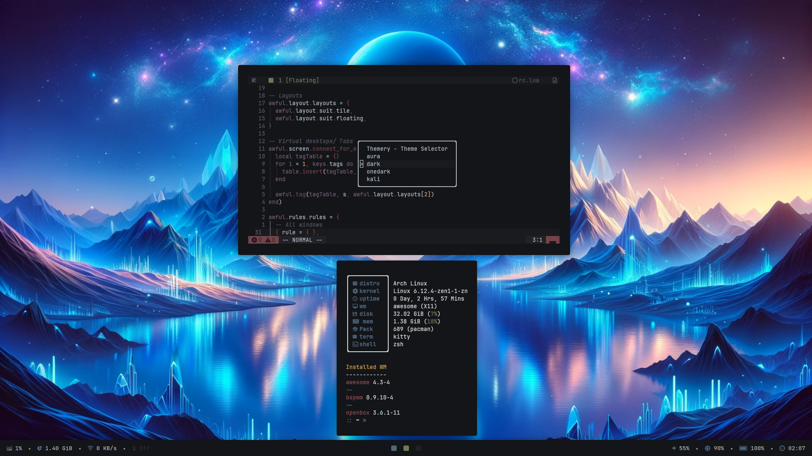
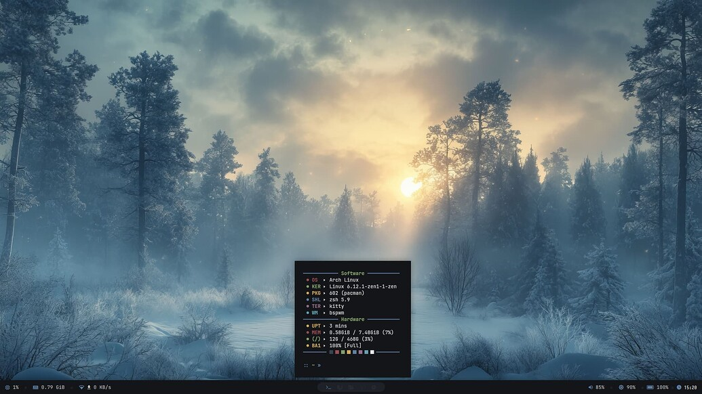
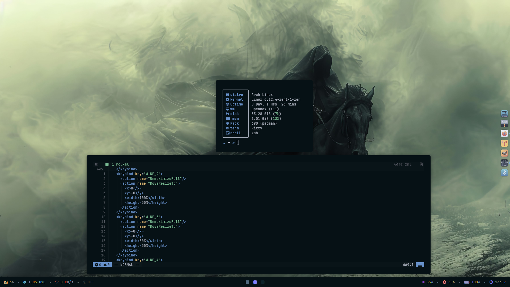

## Awesomewm

## Bspwm

## Openbox 

## :snowflake: My Setup

- **OS: ** Arch Linux
- **WM :** openbox/bspwm/awesomewm
- **Terminal :** kitty/alacritty
- **Shell :** zsh
- **Panel :** polybar
- **Notification :** dunst
- **App launcher :** rofi 
- **File manager :** thunar
- **Screen capture:** maim/scrot
